# Price Alert & Notification System

System do monitorowania cen metali szlachetnych z możliwością definiowania zaawansowanych reguł powiadomień. Projekt zrealizowany jako zadanie rekrutacyjne, w pełni skonteneryzowany i gotowy do uruchomienia jednym poleceniem.

## 🚀 Szybki start

1. cp .env.example .env

2. docker-compose up --build


Wymagania: Zainstalowany **Docker** oraz **Docker Desktop**.

1. Skopiuj projekt na dysk.
2. Otwórz terminal w głównym folderze projektu.
3. Uruchom aplikację komendą:
   ```bash
   docker-compose up --build
   ```
4. Aplikacja będzie dostępna pod adresem: **[http://localhost](http://localhost)**

## 🛠 Technologia

### Backend:
* **Java 21** & **Spring Boot 3**
* **Spring Data JPA** (Hibernate)
* **Baza danych H2** (tryb plikowy - dane są utrwalane na dysku)
* **Lombok** & **SLF4J** (logowanie operacji)
* **SpringDoc OpenAPI** (Swagger UI)

### Frontend:
* **LitElement** (Web Components)
* **Vite** (Build Tool)
* **Nginx** (Serwowanie plików statycznych w kontenerze)

## 📋 Funkcjonalności

* **Dashboard**: Zarządzanie szablonami powiadomień.
* **Dynamiczne Reguły**: Możliwość definiowania wielu reguł logicznych (AND) dla każdego szablonu (np. produkt = GOLD oraz cena < 2500).
* **Wyszukiwarka**: Sidebar z filtrowaniem szablonów po tytule w czasie rzeczywistym (zoptymalizowane kwerendy `LIKE` na backendzie).
* **Paginacja**: Obsługa dużych zbiorów danych po stronie serwera.
* **Walidacja**: Zaawansowana walidacja typów metali, poprawności adresów email oraz operatorów cenowych.

## 🗄 Przechowywanie danych

Zgodnie z wymaganiami zadania, system nie korzysta wyłącznie z zapisu in-memory. 
* Dane są składowane w plikowej bazie **H2** znajdującej się w folderze `/data`.
* Dzięki zastosowaniu **Docker Volumes**, baza danych jest zmapowana do kontenera, co zapewnia trwałość danych (Persistence) nawet po całkowitym usunięciu i ponownym zbudowaniu kontenerów.

## 🔍 Dokumentacja API

Po uruchomieniu aplikacji, pełna dokumentacja techniczna endpointów (Swagger UI) jest dostępna pod adresem:
**[http://localhost:8080/swagger-ui/index.html](http://localhost:8080/swagger-ui/index.html)**

## 📁 Struktura projektu

* `/backend` - Kod źródłowy Spring Boot, Dockerfile.
* `/frontend` - Kod źródłowy LitElement, Dockerfile.
* `/data` - Lokalizacja pliku bazy danych `alertdb`.
* `docker-compose.yml` - Orkiestracja całego systemu.

## 🖼️ Screeny

**Dashboard**
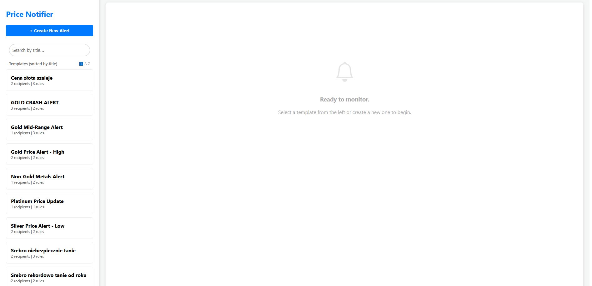

**Edycja pojedyńczego szablonu**
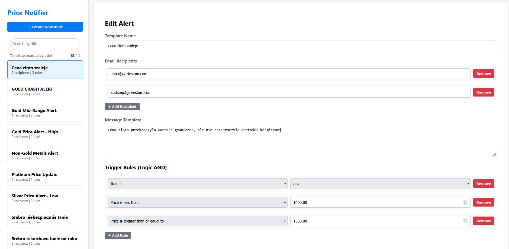


**Potwierdzenie usuwania**
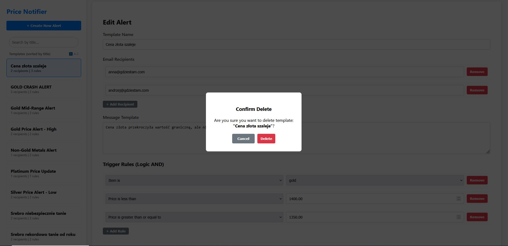


**Paginacja**
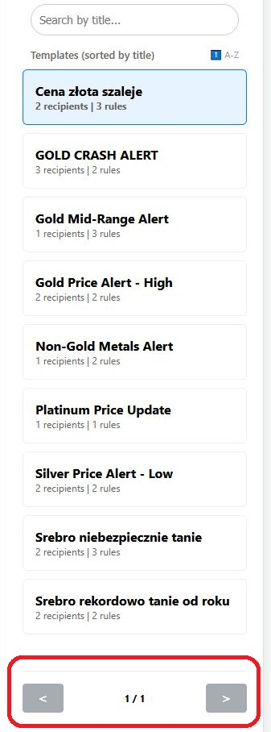


**Fitrowanie po nazwie szablonu**
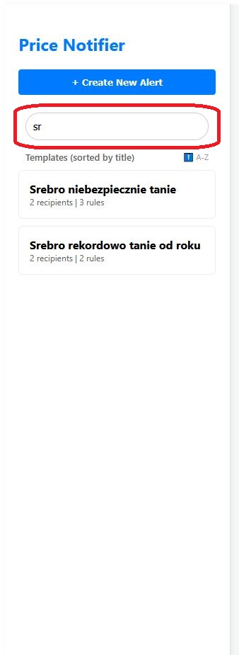

**Dodawanie nowego szablonu**
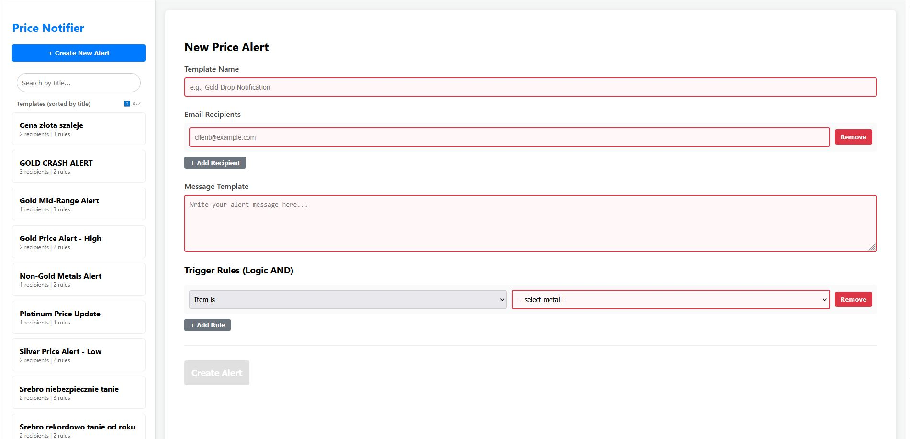

**Konsola H2 http://localhost:8080/h2-console/**
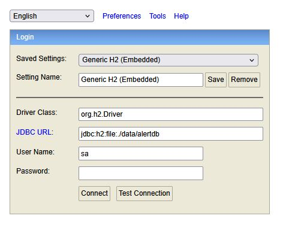

**Konsola H2  wykaz szablonów**
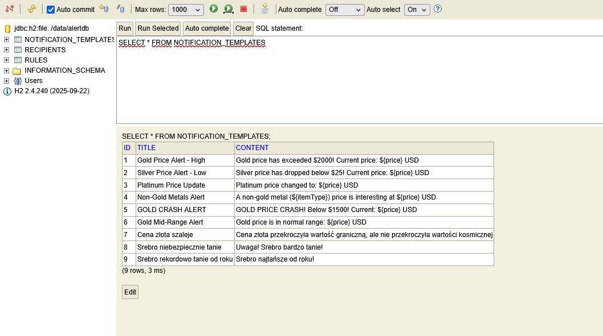

**Swagger http://localhost:8080/swagger-ui/**
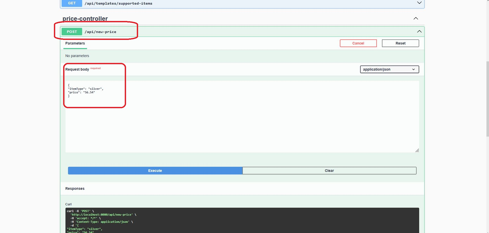

**Logi z przykładowego sygnału wejściowego** 
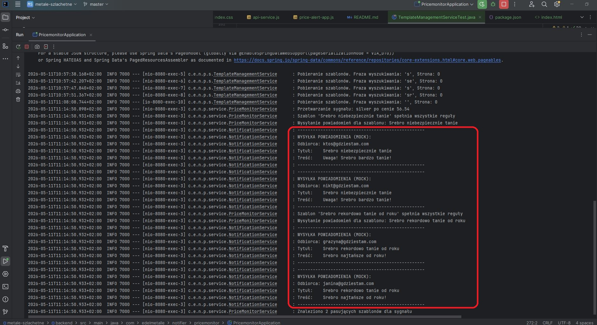

**Docker Desktop**
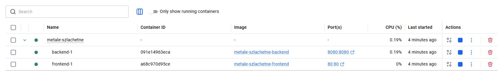


**Frontend z Dockera http://localhost/**
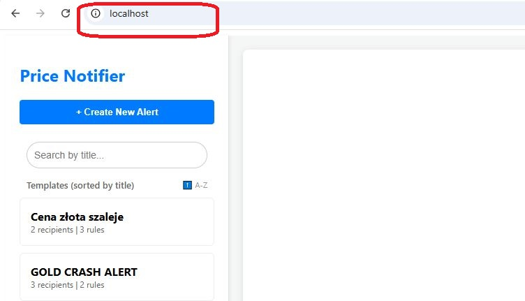

**Frontend lokalnie http://localhost:5173/**
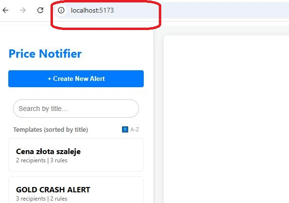
```
